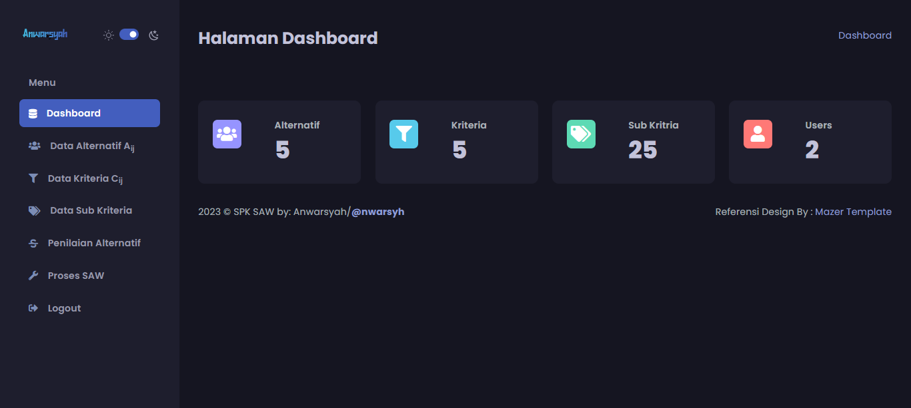
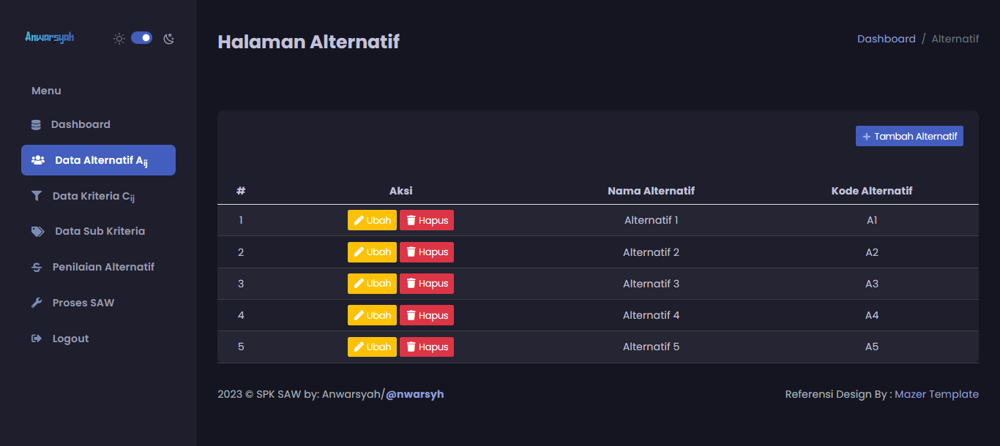
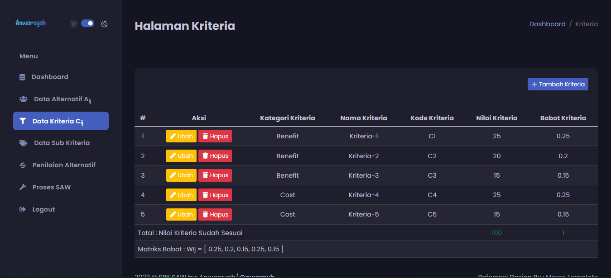
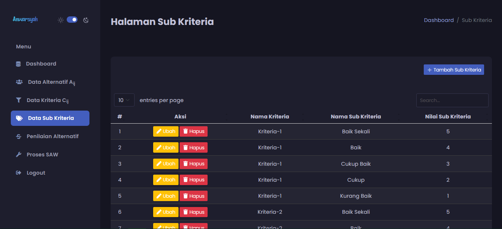
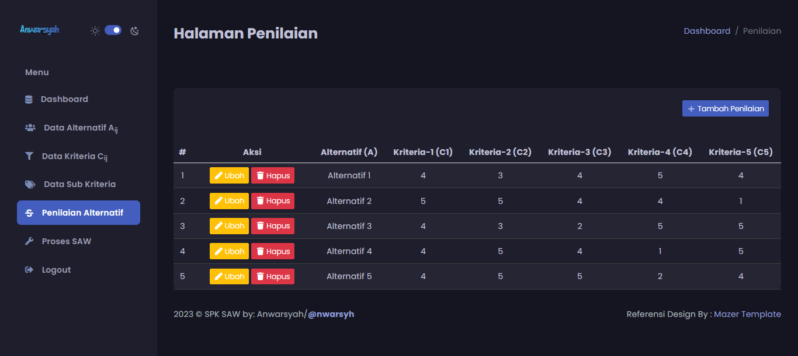
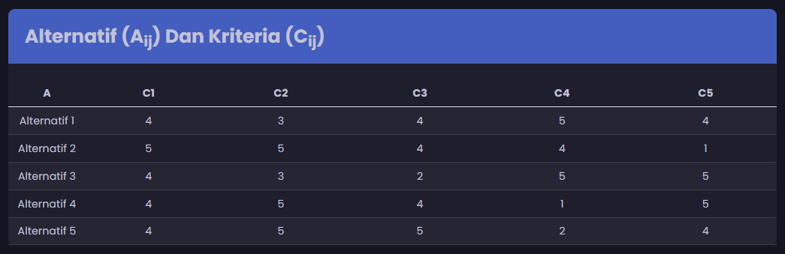
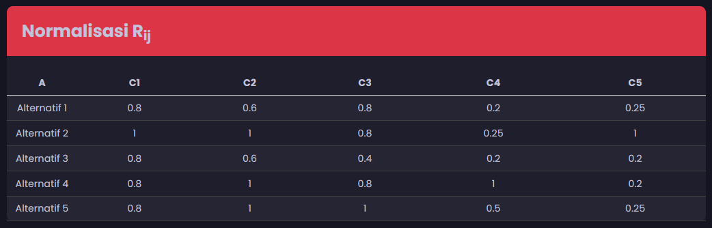
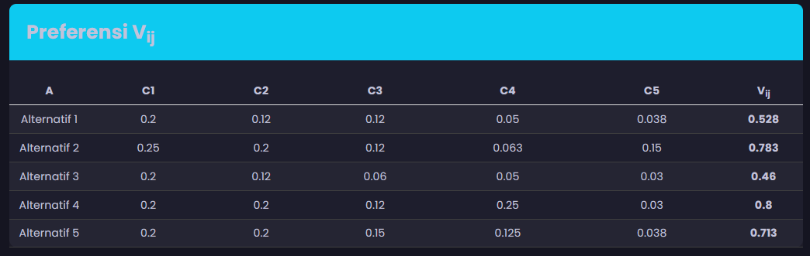
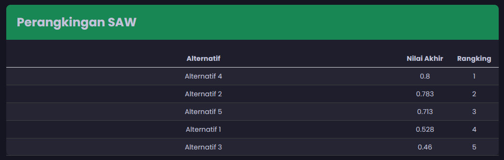

# SPK SAW PHP MVC
Aplikasi sistem perhitungan Sistem Pedukung Keputusan (SPK) Metode SAW (Simple Additive Weighting) berbasis web dengan menggunakan PHP+MySqli dan sistem MVC

## Instalasi
1. Simpan project ke dalam direktori lokal XAMPP (htdocs).
2. Buat database dengan nama: `db_spk_saw_php_mvc`.
3. Import database yang ada di: public/database/db_spk_saw_php_mvc.sql
4. Ubah file **.htaccess** pada baris: RewriteBase /spk_saw_php_mvc/ `Sesuaikan dengan lokasi project.` ;
5. Ubah file **app/config/config.php** pada baris: define('BASEURL', 'http://spk_saw_php_mvc') `Sesuaikan dengan lokasi project.` ;

## Fitur
1. Routing aplikasi pada folder routing seperti : `(Routing Aplikasi)`, `(Controller Aplikasi)`, `(Database Aplikasi)` ;
2. Penggunaan **Models** Setiap File Proses SQL;
3. Penggunaan **Controlers** Untuk Konfigurasi Laman ; 
4. Penggunaan **views** Untuk Tampilan Laman ;
5. Fitur Login dan Logout
6. CRUD Data Alternatif ;
7. CRUD Data Kriteria ;
8. CRUD Data Sub Kriteria ;
9. CRUD Data Data Alternatif dan Kriteria ;
10. Proses SPK SAW : Normalisaisi, Preferensi, Perangkingan ;
11. Dan lainnya.

##Teknologi
1. PHP 7 ke aatas
2. MySQL (PDO)
3. Bootstrap
4. Font Awesome
4. Mazer Templates

## Screenshot
### Laman Dashboard

### Laman ALternatif

### Laman Kriteria

### Laman Sub Kriteria

### Laman Input Penilaian

### Laman Proses Data

### Laman Proses Normalisasi

### Laman Proses Preferensi

### Laman Perangkingan

## Sumber Referensi
- Template: [Mazer Template](https://zuramai.github.io/mazer/)
- SAW dan SPK dari Artikel, Website dan lainnya
- Tutorial Artikel dari Buku
- Serta hasil belajar dari berbagai sumber lainnya

## Tujuan
Repository ini dibuat untuk **pembelajaran pribadi** dan **latihan menggunakan GitHub**.
Semoga bisa bermanfaat bagi yang mau belajar, silahkan kembangkan lebi lanjut 🙌

## License
Proyek ini dirilis dengan lisensi **MIT**, dan dibuat khusus untuk tujuan pembelajaran.  
Boleh dipelajari, digunakan, dan dikembangkan lebih lanjut selama tetap mencantumkan kredit.  

Lihat file [LICENSE](LICENSE) untuk detail lengkap.

# Terima Kasih

